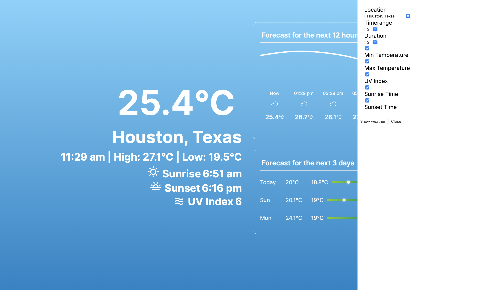
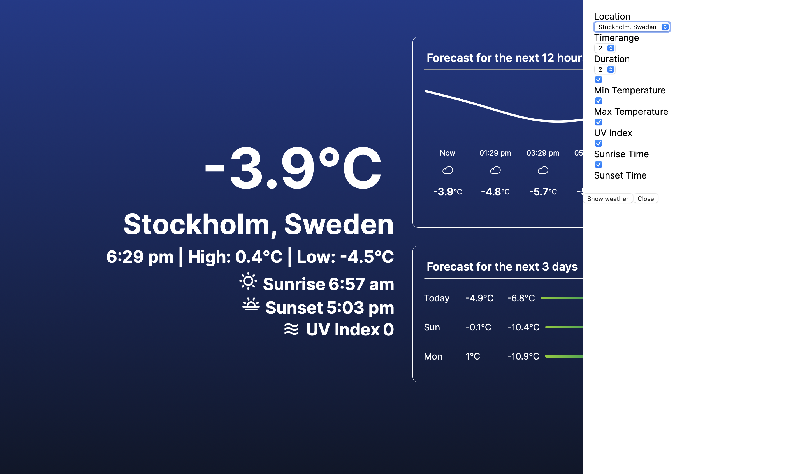

This is a [Next.js](https://nextjs.org/) project bootstrapped with [`create-next-app`](https://github.com/vercel/next.js/tree/canary/packages/create-next-app).

## Getting Started

First, run the development server:

```bash
npm run dev
# or
yarn dev
# or
pnpm dev
```

Open [http://localhost:3000](http://localhost:3000) with your browser to see the result.

## Using the Application

By default the application gets the weather data for the location Houston, which can be updated along with other parameters such as 
```javascript
  Timerange // This is used to set for how many days from today you want to show the weather of
  Duration // This is used to set the intervals between the weather data (Step count)
  Min Temperature // Show the minimum temperature or not
  Max Temperature // Show the maximum temperature or not
  UV Index // Show the UV Index or not
  Sunrise Time // Show the sunrise time or not
  Sunset Time // Show the sunset time or not
```

All thest values can be configured in the sidebar as shown below




## App Structure

The app follows a default React app structure. I have created the webapp using NextJS 13 framework. 


```Javascript
 - assets // Contains all the images/video files required for the application
 - components // Contains all the small components that are used within the application
 - config // Contains all the configuration files. (Example constants.js contains the constant variables used in the application)
 - lib // Contains all the libraries that are used in the application (Example dayjs, auth, api)
 - pages // Created by default by next js (These are all the pages for the application)
 - stlyes // Contains all the css styles needed for the application
```