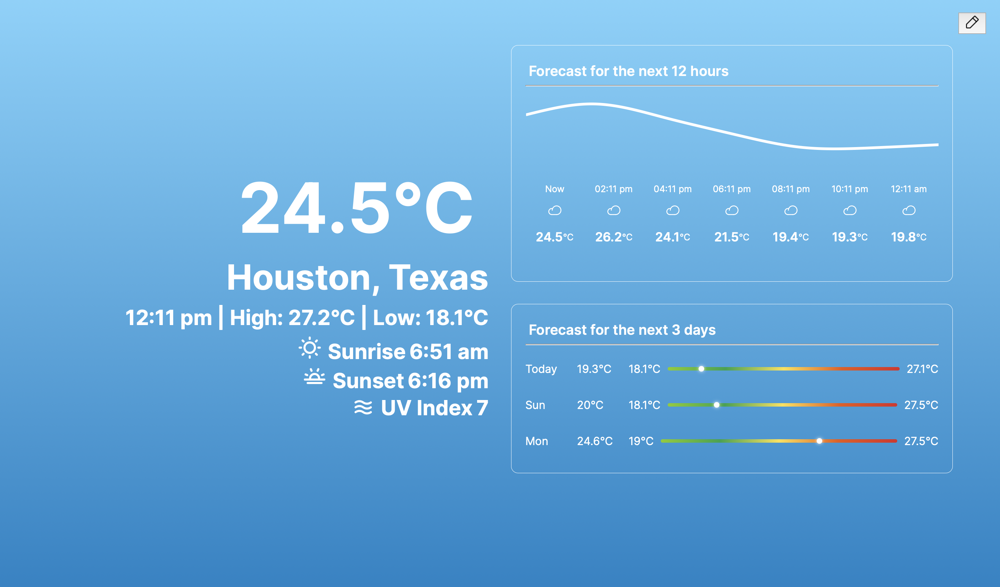
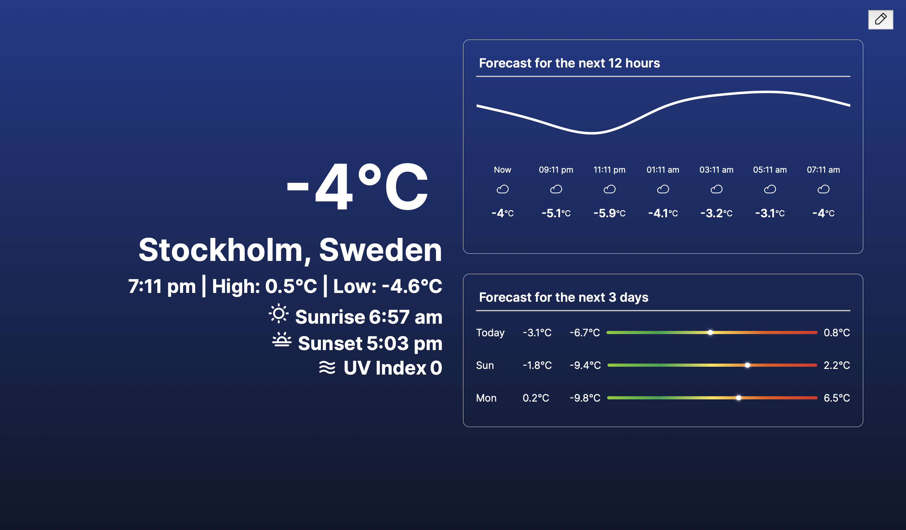
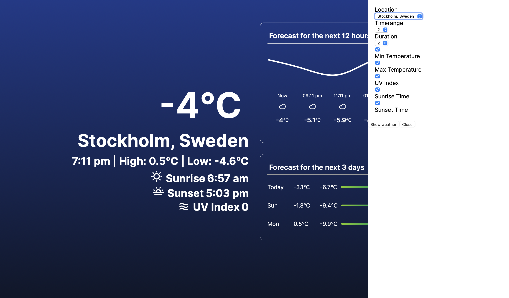
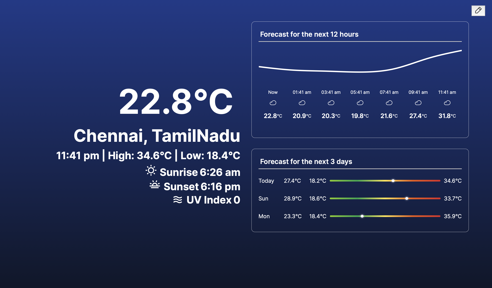
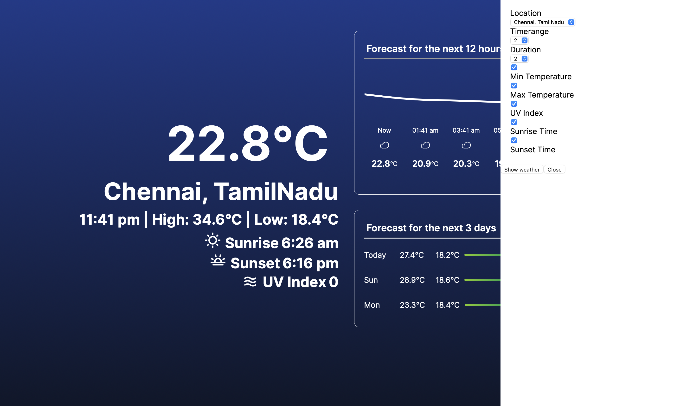
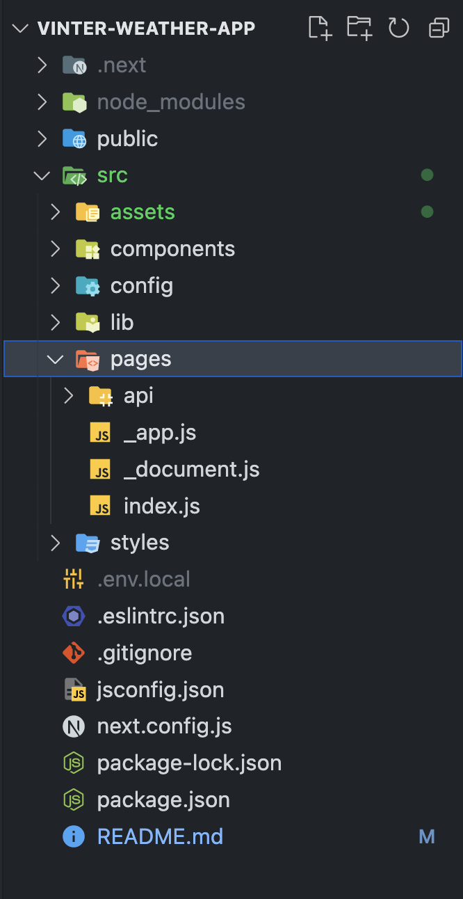
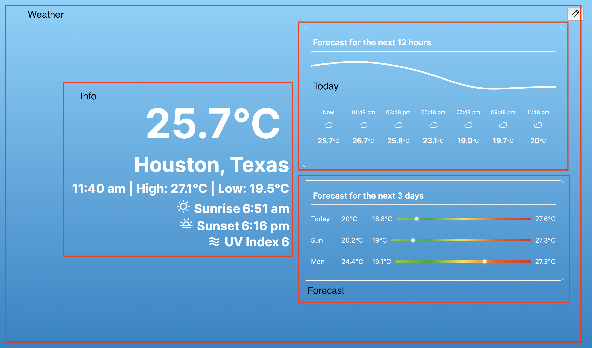

This is a [Next.js](https://nextjs.org/) project bootstrapped with [`create-next-app`](https://github.com/vercel/next.js/tree/canary/packages/create-next-app).

## Getting Started

First, run the development server:

```bash
npm run dev
# or
yarn dev
# or
pnpm dev
```

Open [http://localhost:3000](http://localhost:3000) with your browser to see the result.

## Using the Application

By default the application gets the weather data for the location Houston, which can be updated along with other parameters such as 
```javascript
  Timerange // This is used to set for how many days from today you want to show the weather of
  Duration // This is used to set the intervals between the weather data (Step count)
  Min Temperature // Show the minimum temperature or not
  Max Temperature // Show the maximum temperature or not
  UV Index // Show the UV Index or not
  Sunrise Time // Show the sunrise time or not
  Sunset Time // Show the sunset time or not
```

All thest values can be configured in the sidebar as shown below
 - Location 1 (Houston)



 - Location 2 (Stockholm)



 - Location 3 (Chennai)



## App Structure

The app follows a default React app structure. I have created the webapp using NextJS 13 framework. 


```Javascript
 - assets // Contains all the images/video files required for the application
 - components // Contains all the small components that are used within the application
 - config // Contains all the configuration files. (Example constants.js contains the constant variables or routes used in the application)
 - lib // Contains all the libraries that are used in the application (Example dayjs, auth, api)
 - pages // Created by default by next js (These are all the pages for the application)
 - pages / index // The entry point into the app
 - pages / api / *.js // Next JS server app that will be used to make api calls from our client to avoid CORS issues
 - stlyes // Contains all the css styles needed for the application
```

## Functionalities

### Authentication
The `https://login.meteomatics.com/api/v1/token` is used to get an access token needed for the apis that are used to fetch the weather from meteomatics. 

`lib/api.js` -> `fetchWeatherData()` contains the api method to fetch the weather data. Before each call, we will call the 
```javascript
  import { LOGIN_URL } from '@/config/routes';
  import dayjs from '../lib/day';
  import { getStorage, setStorage } from "./storage";

  const setAndReturnAccessToken = async() => {
    const response = await fetch(LOGIN_URL, { method: 'GET' });
    const { access_token } = await response.json();
    setStorage('auth', JSON.stringify({ createdAt: dayjs().valueOf(), token: access_token }));
    return access_token;
  }

  export const checkAccessTokenValidity = async() => {
    let auth = getStorage("auth") ?? null;
    if (auth) {
      auth = JSON.parse(auth);
      if (dayjs().isAfter(dayjs(auth.createdAt).add(2, 'hours'))) {
        return setAndReturnAccessToken();
      }
      return auth.token;
    }
    return setAndReturnAccessToken();
  }
```
method from `lib/auth.js` to check if we have a valid token saved in the local storage and If we do, then we check its time validity if the creation time is after 2 hours. If it is, then fetch a new token and save it to the local storage.

Our fetchWeatherData() would look like
```javascript
  import { WEATHER_URL } from '@/config/routes';
  import { checkAccessTokenValidity } from './auth';

  export const fetchWeatherData = async(config) => {
    const token = await checkAccessTokenValidity();
    const newConfig = { ...config, token };
    const parameters = new URLSearchParams(newConfig).toString()
    const response = await fetch(WEATHER_URL(parameters), { method: 'GET' });
    return response.json()
      .then(({ data }) => data)
      .catch(error => console.log(error))
  }
```

`pages/api/login.js`
```javascript
  import { METEOMATICS_TOKEN } from "@/config/routes";

  export default async function handler(req, res) {
    try {
      const baseToken = Buffer.from(process.env.NEXT_PUBLIC_API_USERNAME + ":" + process.env.NEXT_PUBLIC_API_PASSWORD).toString('base64')
      const result = await fetch(METEOMATICS_TOKEN, {
        method: 'GET',
        headers: { 
          'Authorization': `Basic ${baseToken}`,
          'Content-Type': 'application/json',
        },
      });
      const { access_token } = await result.json();
      return res.status(200).json({ access_token })
    } catch (error) {
      return res.status(500).json({ success: false })
    }
  }
```

`pages/api/weather.js`
```javascript
  import { METEOMATICS_WEATHER } from "@/config/routes";

  export default async function handler(req, res) {
    const config = req.query;

    let BASE_URL = METEOMATICS_WEATHER;
    BASE_URL += config.datetime + "P" + config.timerange + "D:PT" + config.duration + "H/";
    BASE_URL += config.parameters + "/";
    BASE_URL += config.coordinates + "/";
    BASE_URL += `json?access_token=${config.token}`;

    const response = await fetch(BASE_URL, {
      method: 'GET',
      headers: {
        'Content-Type': 'application/json',
      }
    });
    return response.json()
      .then(({ data }) => {
        const processedData = { location: "", weatherData: {} };
        data.forEach(({ parameter, coordinates }) => {
          processedData.location = { lat: coordinates[0].lat, lon: coordinates[0].lon };
          const timestamps = coordinates[0].dates;
          timestamps.forEach((timestamp) => {
            processedData.weatherData[timestamp.date] = { ...processedData.weatherData[timestamp.date], [parameter]: timestamp.value }
          });
        });
        return res.status(200).json({ data: processedData })
      })
      .catch(error => {
        return res.status(500).json({ success: false, error })
      })
  }
```

The data coming from the weather api is a little complex, so we will clean and process the data to our needs.

## Main Components on UI


## Optimizations and Improvements
It was a challenging task building the entire UI view without any given design or app architecture in 2 days. Although I was able to make the application work, I still wanted to make the following improvements if there was more time and if css frameworks were allowed

- Move application css to Tailwind CSS for faster development and better look
- Design it on Figma before creating the UI
- Break down current components into smaller components
- Clean up the code to look more organized than current

# As tempory fix, to view the application, please use Chrome and also use the CORS extension for chrome, as I am unable to bypass the cors for the login api call

